# BELGESELSEMOFLIX

  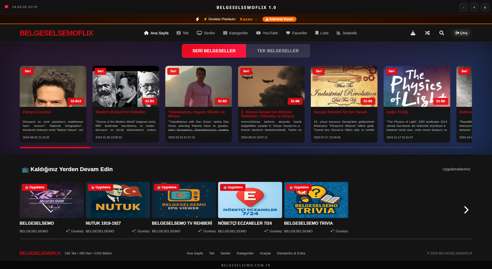

  <strong>BELGESELSEMOFLIX</strong>, <strong>BELGESELSEMO</strong> dünyasını masaüstünde buluşturan; tek belgeselleri, seri yapıları, YouTube seçkilerini, premium ayrıcalıklarını ve yardımcı araçları aynı deneyimde toplayan masaüstü uygulamasıdır.

  <a href="https://rawgit.loltek.net/https://raw.githubusercontent.com/vesvese55x/belgeselsemoflix/refs/heads/main/promo/promo.html" target="_blank" rel="noreferrer"><strong>TANITIM SUNUMU</strong></a>
  ·
  <a href="https://htmlpreview.github.io/?https://github.com/vesvese55x/belgeselsemoflix/blob/main/promo/promo.html" target="_blank" rel="noreferrer"><strong>TANITIM YEDEK LİNK</strong></a>
  ·
  <a href="https://belgeselsemo.com.tr" target="_blank" rel="noreferrer"><strong>BELGESELSEMO.COM.TR</strong></a>
  ·
  <a href="https://github.com/vesvese55x/belgeselsemoflix" target="_blank" rel="noreferrer"><strong>GITHUB</strong></a>

## BELGESELSEMO deneyimi bilgisayarda

BELGESELSEMOFLIX; uzun süre ekranda kalmak isteyen belgesel izleyicileri için hazırlandı. Ana sayfa, tek belgeseller, seri yapılar, kategori akışları, YouTube katmanı ve yardımcı araçlar tek ürün dili içinde bir araya gelir. Kullanıcı, farklı içerik ve araç alanları arasında kopukluk hissetmeden gezinebilir.

  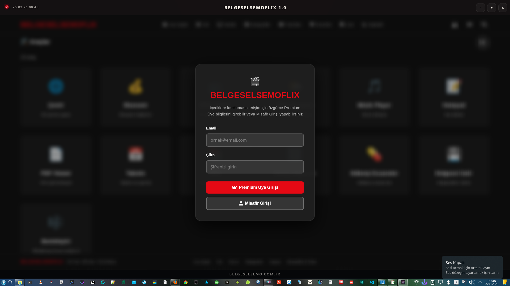
  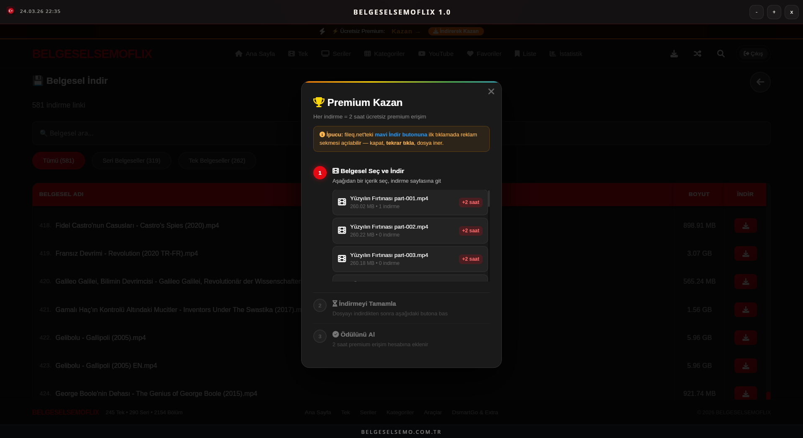

## İçerik katmanları

✨ Tek belgeseller bölümü hızlı keşif ve filtreleme mantığıyla geniş bir kart akışı sunar.  
🎞️ Seri belgeseller alanı sezon ve bölüm takibini daha rahat hale getirir.  
🧭 Kategori yapısı bilimden tarihe, biyografiden doğaya kadar uzanan büyük bir kütüphane hissi verir.  
📺 YouTube belgeseller bölümü, ana katalogu kanal ve oynatma listeleriyle daha da büyütür.  
🔓 Premium ve misafir giriş mantığı aynı ilk açılış deneyiminde net olarak görünür.

  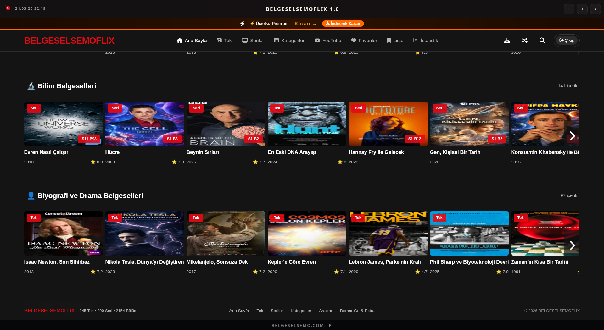
  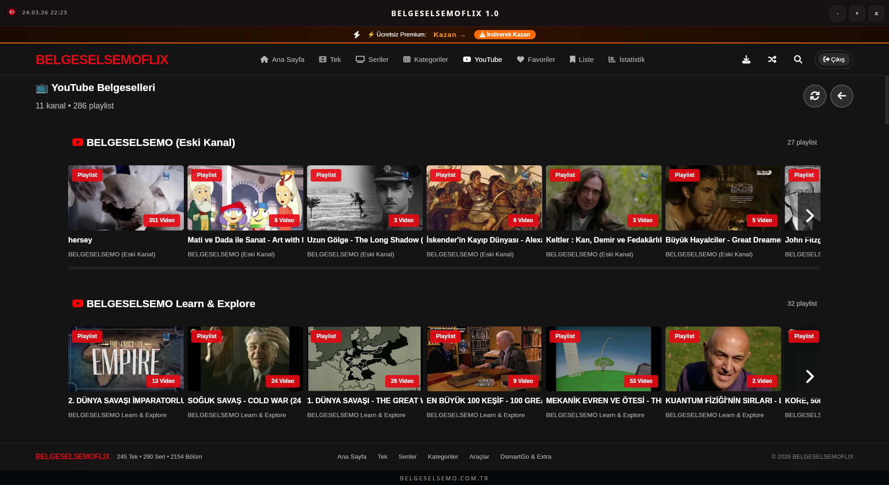

## Yardımcı araçlar ve ek alanlar

BELGESELSEMOFLIX yalnızca belgesel izleme ekranlarından ibaret değildir. EPG görüntüleyici, çeviri, PDF, wiki, müzik, ekonomi ve farklı mini araçlarla uygulama günlük kullanımda da aktif kalır. DsmartGo ve Extra TV tarafları da ürünün içerik evrenini daha geniş hale getirir.

  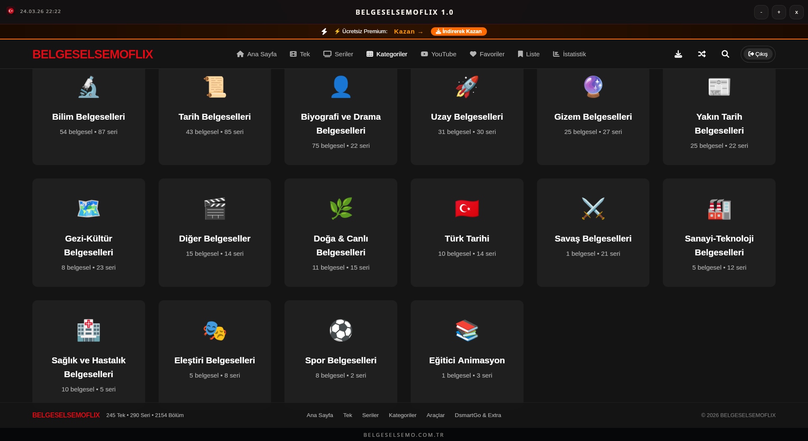
  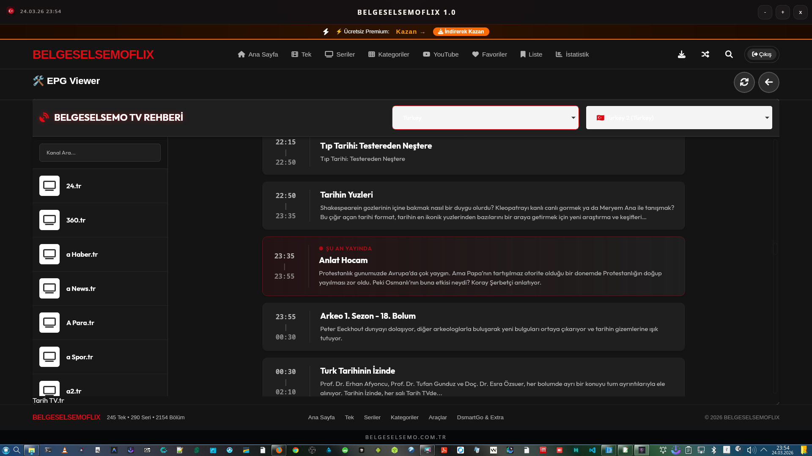
  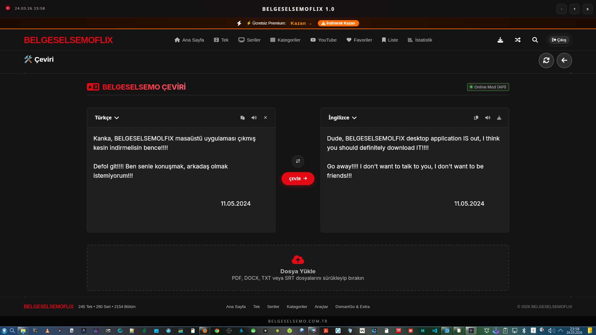

  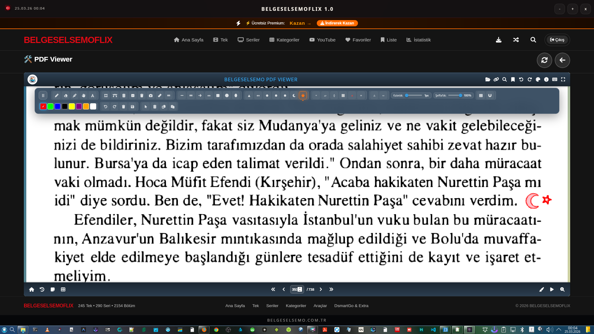
  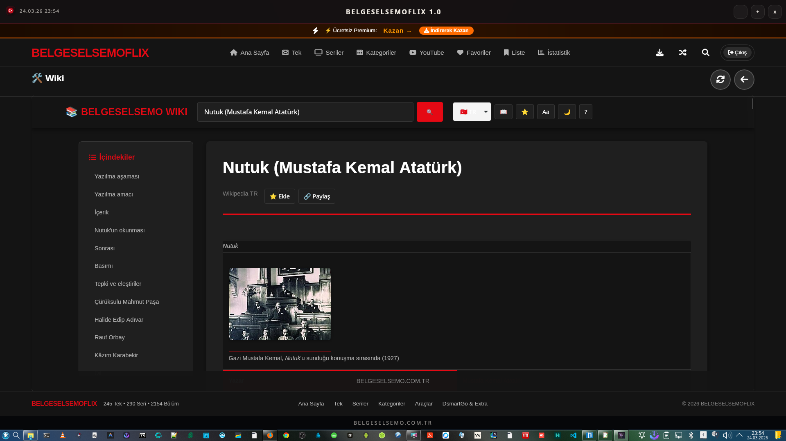
  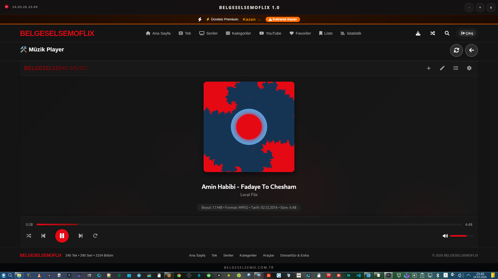

## Premium ayrıcalıklar

Premium taraf, sadece giriş ekranında değil uygulamanın farklı alanlarında da hissedilir. Özellikle belgesel indirme alanı, Premium Üyelere özel bir deneyim katmanı olarak ayrılır ve kullanıcıya daha kontrollü bir erişim akışı sunar.

  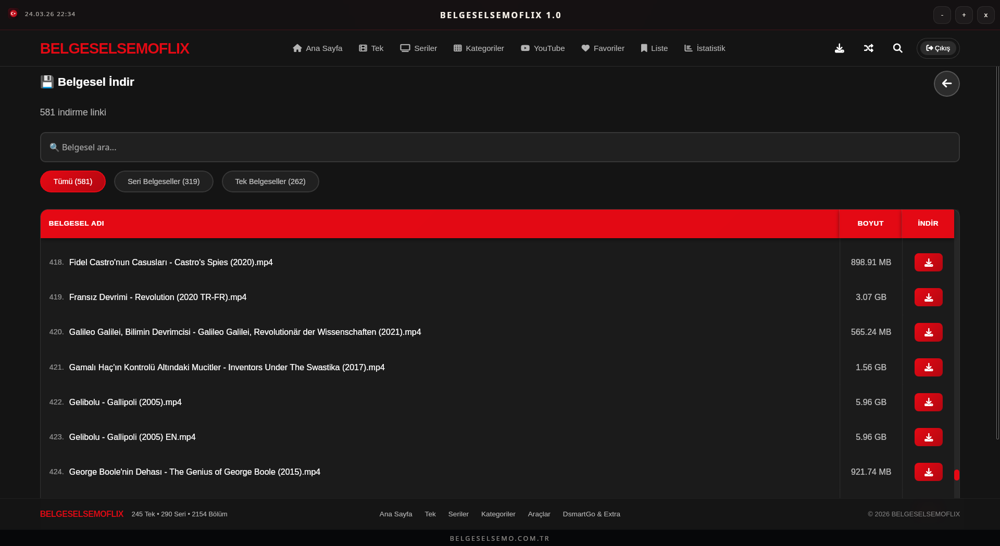

## DsmartGo, Extra TV ve daha büyük evren

BELGESELSEMOFLIX kendi kataloguna kapanmaz. DsmartGo ve Extra TV geçitleri sayesinde kullanıcı, tanıdık ürün dili içinde daha büyük bir medya alanına açılır. Listeleme, seçim ve oynatma ekranları bu nedenle ürünün doğal uzantısı gibi görünür.

  
  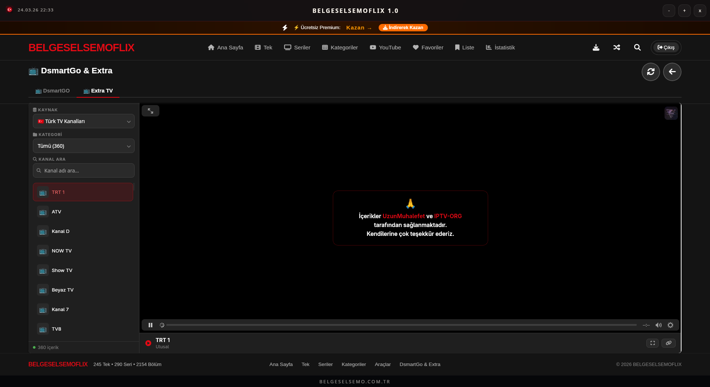
  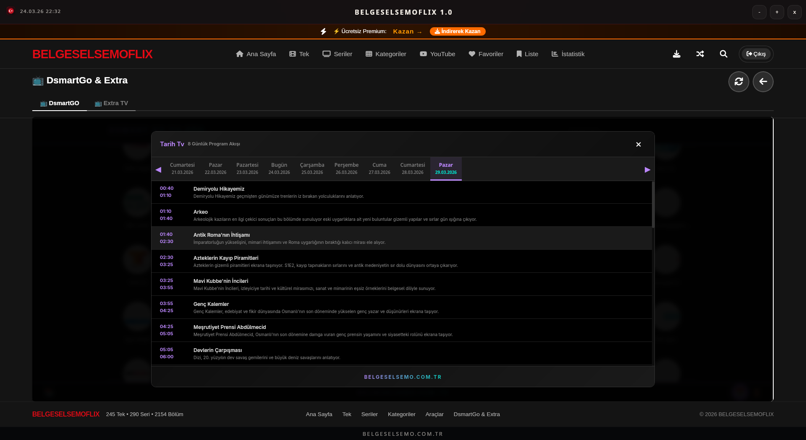

## Platform paketleri ve kurulum komutları

<table>
  <tr>
    <th>Paket</th>
    <th>Ne için?</th>
    <th>Kurulum / Çalıştırma komutu</th>
  </tr>
  <tr>
    <td><strong>Windows Setup</strong></td>
    <td>Kurulum sihirbazı isteyen kullanıcılar için</td>
    <td>
      <code>PowerShell -Command</code> 
      <code>"Invoke-WebRequest -Uri 'https://github.com/vesvese55x/belgeselsemoflix/releases/download/v1.0/BELGESELSEMOFLIX_1.0.0_x64-setup.exe'</code> 
      <code>-OutFile 'BELGESELSEMOFLIX_1.0.0_x64-setup.exe'; Start-Process .\BELGESELSEMOFLIX_1.0.0_x64-setup.exe"</code>
    </td>
  </tr>
  <tr>
    <td><strong>Windows Portable</strong></td>
    <td>Kurulum yapmadan taşınabilir kullanım için</td>
    <td>
      <code>PowerShell -Command</code> 
      <code>"Invoke-WebRequest -Uri 'https://github.com/vesvese55x/belgeselsemoflix/releases/download/v1.0/BELGESELSEMOFLIX-1.0.0-windows-portable.zip'</code> 
      <code>-OutFile 'BELGESELSEMOFLIX-1.0.0-windows-portable.zip'"</code>
    </td>
  </tr>
  <tr>
    <td><strong>Linux .deb</strong></td>
    <td>Debian ve Ubuntu tabanlı sistemler için</td>
    <td>
      <code>sudo apt update</code> 
      <code>&amp;&amp; wget -O BELGESELSEMOFLIX_1.0.0_amd64.deb "https://github.com/vesvese55x/belgeselsemoflix/releases/download/v1.0/BELGESELSEMOFLIX_1.0.0_amd64.deb"</code> 
      <code>&amp;&amp; sudo apt install ./BELGESELSEMOFLIX_1.0.0_amd64.deb</code>
    </td>
  </tr>
  <tr>
    <td><strong>Linux .rpm</strong></td>
    <td>Fedora ve RHEL tabanlı dağıtımlar için</td>
    <td>
      <code>wget -O BELGESELSEMOFLIX-1.0.0-1.x86_64.rpm</code> 
      <code>"https://github.com/vesvese55x/belgeselsemoflix/releases/download/v1.0/BELGESELSEMOFLIX-1.0.0-1.x86_64.rpm"</code> 
      <code>&amp;&amp; sudo dnf install ./BELGESELSEMOFLIX-1.0.0-1.x86_64.rpm</code>
    </td>
  </tr>
  <tr>
    <td><strong>Linux .zst</strong></td>
    <td>Arch Linux ve türevleri için</td>
    <td>
      <code>wget -O belgeselsemoflix-1.0.0-1-x86_64.pkg.tar.zst</code> 
      <code>"https://github.com/vesvese55x/belgeselsemoflix/releases/download/v1.0/belgeselsemoflix-1.0.0-1-x86_64.pkg.tar.zst"</code> 
      <code>&amp;&amp; sudo pacman -U ./belgeselsemoflix-1.0.0-1-x86_64.pkg.tar.zst</code>
    </td>
  </tr>
  <tr>
    <td><strong>Linux AppImage</strong></td>
    <td>Geniş Linux uyumluluğu isteyenler için</td>
    <td>
      <code>wget -O BELGESELSEMOFLIX-1.0.0-x86_64.AppImage</code> 
      <code>"https://github.com/vesvese55x/belgeselsemoflix/releases/download/v1.0/BELGESELSEMOFLIX-1.0.0-x86_64.AppImage"</code> 
      <code>&amp;&amp; chmod +x ./BELGESELSEMOFLIX-1.0.0-x86_64.AppImage &amp;&amp; ./BELGESELSEMOFLIX-1.0.0-x86_64.AppImage</code>
    </td>
  </tr>
  <tr>
    <td><strong>macOS .dmg</strong></td>
    <td>Kurulum imajı ile klasik dağıtım isteyenler için</td>
    <td>
      <code>curl -L "https://github.com/vesvese55x/belgeselsemoflix/releases/download/v1.0/BELGESELSEMOFLIX_1.0.0_aarch64.dmg"</code> 
      <code>-o "BELGESELSEMOFLIX_1.0.0_aarch64.dmg"</code> 
      <code>&amp;&amp; open "BELGESELSEMOFLIX_1.0.0_aarch64.dmg"</code>
    </td>
  </tr>
  <tr>
    <td><strong>macOS .app.zip</strong></td>
    <td>Doğrudan uygulama paketini açmak isteyenler için</td>
    <td>
      <code>curl -L "https://github.com/vesvese55x/belgeselsemoflix/releases/download/v1.0/BELGESELSEMOFLIX.app.zip"</code> 
      <code>-o "BELGESELSEMOFLIX.app.zip"</code>
    </td>
  </tr>
</table>

🌟 Windows tarafında kurulumlu sürüm ile portable sürüm birlikte sunulur.  
🐧 Linux tarafında `.deb`, `.rpm`, `.zst` ve `.AppImage` seçenekleri ayrı ihtiyaçlara göre hazırlanır.  
🍎 macOS tarafında `.dmg` ve `.app.zip` birlikte verilir.  
🧩 En düşük Windows hedefi portable tarafta Windows 7’dir.

## Mobil BELGESELSEMO ekosistemi

BELGESELSEMO dünyası masaüstüyle sınırlı değildir. Android tarafında da belgesel, trivia, TV rehberi, nöbetçi eczane, Nutuk ve yeni ekonomi odaklı uygulama katmanları aynı ekosistemi sürdürür.

📱 <a href="https://play.google.com/store/apps/details?id=com.belgeselsemo.tr" target="_blank" rel="noreferrer">BELGESELSEMO</a>  
🧠 <a href="https://play.google.com/store/apps/details?id=com.belgeselsemo.trivia" target="_blank" rel="noreferrer">BELGESELSEMO TRIVIA</a>  
📡 <a href="https://play.google.com/store/apps/details?id=com.belgeselsemo.epgviewer" target="_blank" rel="noreferrer">BELGESELSEMO TV REHBERİ (EPG)</a>  
💊 <a href="https://play.google.com/store/apps/details?id=com.belgeselsemo.nb724" target="_blank" rel="noreferrer">NÖBETÇİ ECZANELER 7/24 TR-KKTC</a>  
📚 <a href="https://play.google.com/store/apps/details?id=com.belgeselsemo.nutuk" target="_blank" rel="noreferrer">NUTUK 1919-1927</a>  
💹 BELGESELSEMO ECONOMY

## Tanıtım sunumu

Repo içinde uygulamayı daha zengin ve sunum odaklı şekilde anlatan ayrı bir tanıtım sayfası bulunur:

🌐 Canlı tanıtım: <a href="https://rawgit.loltek.net/https://raw.githubusercontent.com/vesvese55x/belgeselsemoflix/refs/heads/main/promo/promo.html" target="_blank" rel="noreferrer">rawgit.loltek.net</a>  
🛟 Yedek tanıtım: <a href="https://htmlpreview.github.io/?https://github.com/vesvese55x/belgeselsemoflix/blob/main/promo/promo.html" target="_blank" rel="noreferrer">htmlpreview.github.io</a>  
📁 Repo içi dosya: <a href="promo/promo.html" target="_blank" rel="noreferrer">promo/promo.html</a>

Bu sayfa; ekranlar, ürün akışı, yardımcı araçlar, platform paketleri ve mobil ekosistemle birlikte BELGESELSEMOFLIX deneyimini tek sahnede anlatır.
